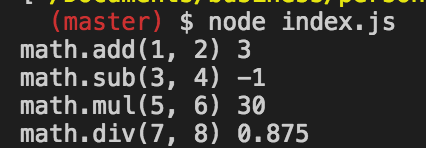

# レポジトリ内容

このレポジトリは[Web白熱教室](https://tsuyopon.xyz/)の[JavaScriptの学習コンテンツ > JavaScriptバックエンド編](https://tsuyopon.xyz/learning-contents/web-dev/javascript/backend/)にある「[【エクササイズ】Node.JSで外部ファイル読み込み&実行を行う](https://tsuyopon.xyz/learning-contents/web-dev/javascript/backend/js-excercise-for-backend-1/)」で利用するものです。

### 完成形

## 課題

以下の「課題をクリアするためのステップ」の内容を全て対応して、`index.html`をブラウザで開き、デベロッパーツールのConsoleを開いたときに上記「完成形」と同じものが表示されるようにする

### 課題をクリアするためのステップ

1. [ ] excerciseディレクトリの中に次の2つファイルを作る
    - index.js
    - math.js
2. [ ] index.jsとmath.jsでは次の内容を実装する(出力結果は上の完成形の画像を参照)
    - index.js
        - math.jsを読み込む
        - math.jsのメソッドを全部実行して、実行結果をconsole.logで出力する
            - ターミナル上に出力される
    - math.js
        - ①: 次の4つのメソッドを持つオブジェクトを作る
            - add : 数値を2つ受け取り「第1引数 + 第2引数」の結果を返す
            - sub : 数値を2つ受け取り、「第1引数 - 第2引数」の結果を返す
            - mul : 数値を2つ受け取り、「第1引数 * 第2引数」の結果を返す
            - div : 数値を2つ受け取り、「第1引数 / 第2引数」の結果を返す
        - ②: ①で作成したオブジェクトを外部に公開する
3. [ ] nodeコマンドを使ってindex.jsを実行して上の画像(完成形)と同じ出力になることを確認する

## 答え

- answersディレクトリ内答えとなるファイルが格納されています
- answersディレクトリ内に「cd」コマンドを使って移動して、「node index.js」とやると答えの実行結果を確認することができます

## 参考記事

課題をこなしていて、行き詰まったら以下の資料を参考にしていただければ解答にたどり着けるかと思います。

- Web白熱教室
  - [Node.JSの環境を整える【インストールする】](https://tsuyopon.xyz/learning-contents/web-dev/javascript/backend/setup-nodejs-environment/)
  - [Node.JSでJavaScriptファイルを実行する方法](https://tsuyopon.xyz/learning-contents/web-dev/javascript/backend/how-to-run-javascript-with-nodejs/)
  - [【Node.JS】ファイルの分割・外部ファイル読み込みの方法](https://tsuyopon.xyz/learning-contents/web-dev/javascript/backend/how-to-load-other-js-files-in-nodejs/)